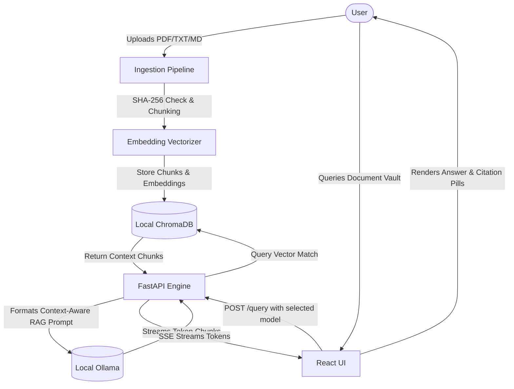

# 🌌 VaultAI - Secure Offline RAG Document Intelligence Suite

VaultAI is a premium, fully offline, private Document Intelligence system and Retrieval-Augmented Generation (RAG) platform. It allows you to query local documents (`.pdf`, `.txt`, `.md`) using open-source Large Language Models (LLMs) running locally via Ollama. 

All computations, embeddings, vector database searches, and text generations occur locally on your machine—ensuring **100% data privacy and security** with zero external API dependencies.

---

## ✨ Features

*   **🔒 100% Local & Private**: No data ever leaves your device. Designed for private, enterprise-grade document intelligence.
*   **⚡ Real-Time Streaming RAG**: Powered by LangChain's Expression Language (LCEL) and FastAPI streaming, presenting instant responses as they generate.
*   **🧠 Dynamic Ollama Integration**: Automatically polls, filters, and speed-rates completion models (e.g. `llama3`, `mistral`, `phi3`) downloaded in your local Ollama instance.
*   **📁 Smart Document Ingestion**: Upload documents via a sleek drag-and-drop zone. Custom chunking, embedding generation (using `nomic-embed-text`), and deduplication are executed instantly.
*   **🗃️ Persistent Vector Database**: Uses ChromaDB to store and index document chunk embeddings.
*   **📊 Pipeline Evaluation Dashboard**: A quality gate suite monitoring retrieval hit rates (Hit@3), answer similarities (custom ROUGE-L metrics calculated using Longest Common Subsequence in Python), and generation latency over time.
*   **🎨 Premium Glassmorphism UI**: Beautifully designed responsive React UI complete with real-time performance telemetry (Time-to-First-Token, generation speed in tokens/sec), Bezier sparklines, canvas particles, and 3D tilting interactions.

---

## 🛠️ Technology Stack

*   **Backend**: FastAPI, LangChain, ChromaDB, SQLite (for evaluation logs), Python 3.10+
*   **Frontend**: React, Vite, Recharts, Framer Motion, Vanilla CSS (Glassmorphism & 3D tilt effects)
*   **Local Inference**: Ollama (`nomic-embed-text` embeddings + `phi3`/`llama3` LLMs)

---

## 🚀 Setup & Installation

### Prerequisites
1.  **Python 3.10+** installed on your system.
2.  **Node.js & NPM** (optional, for frontend developer server).
3.  **Ollama** installed on your system. Pull the required models:
    ```bash
    # Pull default embedding model
    ollama pull nomic-embed-text
    
    # Pull completion model
    ollama pull phi3:latest
    ```

---

## 🏁 Launching VaultAI

Simply double-click or run the `start.bat` file in the root folder:
```cmd
start.bat
```
*(On non-Windows systems, run `python start.py` directly).*

The interactive Python launcher will automatically create your virtual environment (`.venv`), verify python dependencies in `requirements.txt`, install them via pip if missing, and display the control panel:

```text
=====================================================================
            __     __            _ _    _    ___ 
            \ \   / /_ _ _   _  | | |  / \  |_ _|
             \ \ / / _` | | | | | | | / _ \  | | 
              \ V / (_| | |_| | | | |/ ___ \ | | 
               \_/ \__,_|\__,_|_|_|_/_/   \_\___|

          Private Document Intelligence Offline RAG Suite
=====================================================================

Select a startup option:
 [1] Start Backend Server Only (http://127.0.0.1:8000)
 [2] Start Frontend Dev Server Only (http://localhost:3000)
 [3] Start Both Services Concurrently (Recommended)
 [4] Build Frontend & Serve via FastAPI (Unified Python App)
 [5] Run Backend Integration Tests
 [6] Exit
```

### Modes of Operation:
*   **Option 3 (Concurrent Dev Mode)**: Runs the Python FastAPI server and the Vite dev server concurrently, merging and prefixing log streams in a single console window.
*   **Option 4 (Unified App Mode)**: Compiles the React frontend and mounts it natively inside FastAPI. The entire web application (APIs + Frontend UI) runs on a **single Python server at http://127.0.0.1:8000**.

---

## 🐳 Docker Deployment

VaultAI supports containerized deployment using Docker Compose:
```bash
docker-compose up --build
```
This boots the Ollama service, vector DB, and backend application inside isolated containers.

---

## 📐 Project Structure

```text
VaultAI/
├── backend/               # FastAPI Python service
│   ├── app/
│   │   ├── api/           # Document upload, query streaming, model polling
│   │   ├── ingestion/     # PDF loaders, recursive chunking, Chroma embeddings
│   │   ├── rag/           # LangChain prompt templates & streaming chains
│   │   └── config.py      # App configuration setting schemas
│   ├── eval/              # SQLite metrics tracker and RAG evaluation suite
│   │   ├── mock_data.py   # Benchmark test cases & seed historical runs
│   │   ├── metrics.py     # Custom ROUGE-L similarity LCS calculator
│   │   └── routes.py      # Benchmark runner and dynamic CSV/JSON exporter
│   ├── test_api.py        # Automated endpoint integration tests
│   └── requirements.txt   # Python package requirements
├── frontend/              # Vite + React frontend dashboard
│   ├── src/
│   │   ├── components/    # Aurora canvas, RAG diagrams, Three.js Orb, ChatPanel
│   │   ├── pages/         # Landing page & Evaluation suite
│   │   ├── hooks/         # 3D Tilt calculation, uploader state hooks
│   │   └── App.jsx        # Routing and layout assembly
│   ├── index.html
│   ├── package.json
│   └── vite.config.js
├── docker-compose.yml     # Container service mapping
├── start.bat              # Batch wrapper for start.py launcher
├── start.py               # Interactive python environment manager & launcher
└── README.md
```

---

## 🛡️ Secure Ingestion & Chat Workflow



---

## 📜 License
Developed as a private, secure local RAG framework. Code is open-sourced under the MIT License.
