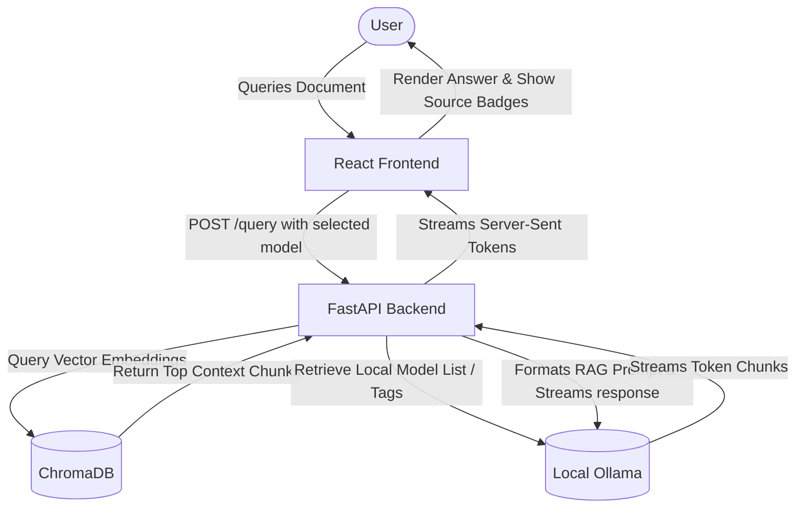

# 🌌 VaultAI - Secure Offline RAG Document Intelligence Suite

VaultAI is a premium, fully offline, private Document Intelligence system and Retrieval-Augmented Generation (RAG) platform. It allows you to query your local documents (PDFs, TXT, MD) using open-source Large Language Models (LLMs) running locally via Ollama. 

All computations, embeddings, vector database searches, and text generations occur locally on your machine—ensuring 100% data privacy and security.

---

## ✨ Key Features

* **🔒 100% Local & Private**: No data ever leaves your device. Built for enterprise and personal document security.
* **⚡ Real-Time Streaming RAG**: Powered by LangChain's Expression Language (LCEL) and FastAPI streaming, presenting instant responses as they generate.
* **🧠 Dynamic Ollama Integration**: Automatically detects, filters, and speed-rates completion models (e.g., `phi3`, `tinyllama`) downloaded in your local Ollama instance.
* **📁 Smart Document Ingestion**: Upload PDFs, TXT, or Markdown documents. Custom chunking, embedding generation (using `nomic-embed-text`), and deduplication are executed instantly.
* **🗃️ Persistent Vector Database**: Uses ChromaDB to store and index document chunk embeddings.
* **📊 Retrieval Evaluation Dashboard**: Built-in pipeline evaluation monitoring hit rates (hit@3), answer similarities (ROUGE-L metrics), and generation latency over time.
* **🎨 Premium Glassmorphism UI**: Beautifully designed UI complete with real-time performance metrics (Time-to-First-Token, generation speed in t/s), bezier sparklines, and 3D tilting interactions.

---

## 🛠️ Technology Stack

* **Backend**: FastAPI, LangChain, ChromaDB, SQLite (for eval results), Python 3.10+
* **Frontend**: React, Vite, Lucide-React, Custom Vanilla CSS (Glassmorphism & 3D tilt effects)
* **Local Inference**: Ollama

---

## 🚀 Setup & Installation

### Prerequisites
1. **Python 3.10+** installed and added to your system `PATH`.
2. **Node.js & NPM** installed for launching the frontend developer server.
3. **Ollama** installed on your system. Run the following commands to download the required models:
   ```bash
   # Download the default embedding model
   ollama pull nomic-embed-text
   
   # Download a completion model (e.g., phi3 or tinyllama)
   ollama pull phi3:latest
   ollama pull tinyllama:latest
   ```

### ⚙️ Environment Configuration

Create or modify the `.env` file in the `backend/` directory or workspace root:
```env
OLLAMA_BASE_URL=http://localhost:11434
CHROMA_PATH=./chroma_db
EMBED_MODEL=nomic-embed-text
LLM_MODEL=phi3:latest
```

### 🏁 Launching VaultAI (Windows)

Simply double-click or run the `start.bat` control panel from the root folder:
```cmd
start.bat
```
This utility automatically configures your virtual environment (`.venv`), installs all python packages listed in `requirements.txt`, and provides a selection menu:

```text
=====================================================================
  [1] Start Backend Server Only (http://127.0.0.1:8000)
  [2] Start Frontend Server Only (http://localhost:3000)
  [3] Start Both Services Concurrently (Recommended)
  [4] Run Backend Integration Tests
=====================================================================
```
Choose Option **`3`** to concurrently launch both the API backend and the React frontend.

---

## 🐳 Docker Deployment
VaultAI supports containerized deployment using Docker Compose:
```bash
docker-compose up --build
```
This launches:
* An **Ollama** service mapping to port `11434`.
* The **FastAPI Backend** service mapping to port `8000`.

---

## 📐 Project Structure

```text
VaultAI/
├── backend/               # FastAPI backend service
│   ├── app/
│   │   ├── api/           # API endpoints (Upload, Query, Dynamic Models list)
│   │   ├── ingestion/     # PDF loading, custom chunking, and embedding pipelines
│   │   ├── rag/           # LangChain LCEL RAG configurations
│   │   └── config.py      # App configurations
│   ├── eval/              # SQLite metrics tracker and RAG evaluation runner
│   ├── test_api.py        # Integration test suites
│   ├── requirements.txt   # Python dependencies
│   └── Dockerfile
├── frontend/              # Vite + React frontend dashboard
│   ├── src/
│   │   ├── components/    # Reusable UI controls, 3D Canvas, Chat, and Sidebar layouts
│   │   ├── pages/         # Secure Chat, Document Vault, and Evaluation pages
│   │   ├── hooks/         # Theme toggles and async uploader utilities
│   │   ├── App.jsx        # Main application router
│   │   └── index.css      # Core styles & layout system
│   └── package.json
├── docker-compose.yml     # Container services configuration
├── start.bat              # Windows automated initialization script
└── README.md
```

---

## 🛡️ Secure Chat Workflow



---

## 📜 License
Developed as a secure, private document reasoning platform. Code is open-sourced under the MIT License.
