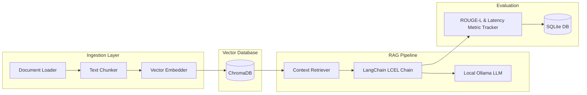

# 🐍 VaultAI Backend - Secure Python RAG Engine

The backend of VaultAI is a high-performance, secure, and fully offline Retrieval-Augmented Generation (RAG) and document reasoning engine built in Python using FastAPI, LangChain, and ChromaDB.

---

## 🛠️ Backend Architecture

The backend consists of four primary layers: Ingestion, Retrieval-Augmented Generation (RAG), Pipeline Evaluation, and API Services.



---

## 📁 Key Components

### 1. Ingestion Pipeline (`app/ingestion/`)
Handles the reading, parsing, splitting, and vectorizing of documents.
*   **[loader.py](file:///c:/Users/shara/OneDrive/Desktop/VaultAI/backend/app/ingestion/loader.py)**: Extracts text contents from `.pdf`, `.txt`, and `.md` files. Handles PDF page-by-page rendering and extracts page numbers.
*   **[chunker.py](file:///c:/Users/shara/OneDrive/Desktop/VaultAI/backend/app/ingestion/chunker.py)**: Splits documents into manageable text blocks using a recursive character text splitter. The default chunk size is **512 characters** with an overlap of **64 characters** to maintain semantic context at boundaries.
*   **[embedder.py](file:///c:/Users/shara/OneDrive/Desktop/VaultAI/backend/app/ingestion/embedder.py)**: Integrates with Ollama to run the local `nomic-embed-text` embedding model. Vectorizes chunks and stores them in ChromaDB. Computes SHA-256 hashes of text chunks to skip indexing duplicate files.

### 2. RAG Engine (`app/rag/`)
Queries the vector database and coordinates the offline model response.
*   **[retriever.py](file:///c:/Users/shara/OneDrive/Desktop/VaultAI/backend/app/rag/retriever.py)**: Sets up a vector search query against ChromaDB. Returns the top $K$ (default: 4) document chunks matching the user's question.
*   **[chain.py](file:///c:/Users/shara/OneDrive/Desktop/VaultAI/backend/app/rag/chain.py)**: Assembles the retrieval-augmented prompt using LangChain Expression Language (LCEL). Formats context document segments and feeds them into the chosen local model (e.g. `llama3` or `phi3`). Streams token-by-token responses back to the client using Server-Sent Events (SSE).

### 3. Pipeline Quality & Evaluation (`eval/`)
Measures and charts the performance and accuracy of RAG operations.
*   **[metrics.py](file:///c:/Users/shara/OneDrive/Desktop/VaultAI/backend/eval/metrics.py)**: Implements custom ROUGE-L F1 similarity checking by computing the Longest Common Subsequence (LCS) between the generated answer and the ground truth.
*   **[routes.py](file:///c:/Users/shara/OneDrive/Desktop/VaultAI/backend/eval/routes.py)**: Runs a series of 15 test cases against document collections, measures Retrieval Hit@3, calculates generation quality, tracks latency, and logs runs into a local SQLite database (`eval_results.db`). Includes a Python-side fallback simulation to return simulated runs if the local RAG pipeline is offline.
*   **[mock_data.py](file:///c:/Users/shara/OneDrive/Desktop/VaultAI/backend/eval/mock_data.py)**: Defines default RAG evaluation benchmarks and seeds the dashboard with historical mock data.

---

## 🔌 API Reference

### Document Operations

| Method | Endpoint | Description | Request Payload | Response |
| :--- | :--- | :--- | :--- | :--- |
| **POST** | `/upload` | Upload and vectorize document | Multipart Form (`file`, optional `collection_name`) | `UploadResponse` (JSON) |
| **GET** | `/documents` | List stored vaults and collections | None | `List[DocumentInfo]` (JSON) |
| **DELETE** | `/documents/{name}`| Delete collection from ChromaDB | Path parameter `collection_name` | `{"status": "deleted"}` |

### Secure Chat & Inference

| Method | Endpoint | Description | Request Payload | Response |
| :--- | :--- | :--- | :--- | :--- |
| **POST** | `/query` | Chat query against document vault | `QueryRequest` (JSON) | Streaming response (Text tokens), exposes sources in `X-Sources` header |
| **GET** | `/models` | Poll models downloaded in Ollama | None | `List[{"name", "size", "speed"}]` |
| **GET** | `/chat/suggestions`| Get recommended quick prompt questions| None | `List[str]` |

### Pipeline Evaluation Dashboard

| Method | Endpoint | Description | Request / Path Parameter | Response |
| :--- | :--- | :--- | :--- | :--- |
| **POST** | `/eval/run` | Execute benchmark evaluation suite | `EvalRequest` (JSON) | `EvalRunResponse` |
| **GET** | `/eval/runs` | List evaluation run history | None | `List[EvalRunResponse]` |
| **GET** | `/eval/runs/{id}` | Get detailed report for a run ID | Path parameter `run_id` | `EvalRunResponse` with question-by-question metrics |
| **GET** | `/eval/export/{id}`| Generate and download JSON/CSV report| Path parameter `run_id`, query parameter `format=json\|csv` | File attachment download |
| **GET** | `/eval/default_test_cases` | Get 15 benchmark questions | None | `List[{"question", "expected_source", "ground_truth"}]` |
| **GET** | `/eval/mock_runs` | Get seed mock run dataset | None | `List[EvalRunResponse]` |

---

## 🛠️ Local Verification & Testing

You can run backend API integration tests by executing:
```bash
# Ensure your virtual environment is active
.venv\Scripts\activate.bat

# Run the test suite
python test_api.py
```

The test runner will automatically create a temporary text file, verify ingestion, check document lookup routes, run mock query streams, execute RAG pipeline evaluations, log results to SQLite, and clean up.
